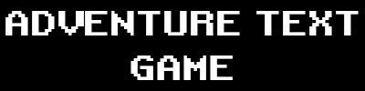
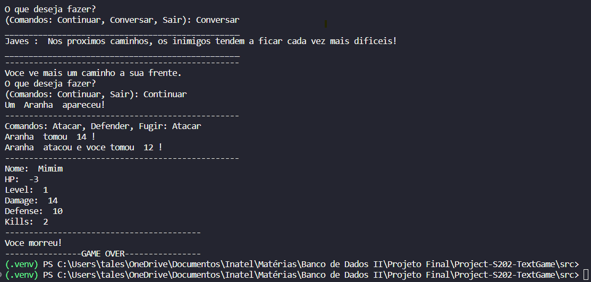

<br/>
<p align="center">
  <a href="https://github.com/RobinCharles984/Project-S202-TextGame">
    
  </a>

  <p align="center">
    Adventure Text Game
    <br/>
    <br/>
    <a href="https://github.com/RobinCharles984/Project-S202-TextGame"><strong>Explore the docs »</strong></a>
    <br/>
    <br/>
    <a href="https://github.com/RobinCharles984/Project-S202-TextGame">View Demo</a>
    .
    <a href="https://github.com/RobinCharles984/Project-S202-TextGame/issues">Report Bug</a>
    .
    <a href="https://github.com/RobinCharles984/Project-S202-TextGame/issues">Request Feature</a>
  </p>
</p>

    

## Table Of Contents

* [About the Project](#about-the-project)
* [Built With](#built-with)
* [Getting Started](#getting-started)
  * [Prerequisites](#prerequisites)
  * [Installation](#installation)
* [Usage](#usage)
* [Roadmap](#roadmap)
* [Contributing](#contributing)
* [License](#license)
* [Authors](#authors)
* [Acknowledgements](#acknowledgements)

## About The Project



The project is being created for Database class, using Python with a database, we choose MongoDB. The project is just a simple adventure text game where:
* You can create your character by name
* The caracter will receive randor attributes when created
* You can fight enemies along the little story
* You can also collect itens
* Those informations will be saved at the MongoDB database

## Built With

* Python
* MongoDB
* Visual Studio Code

## Getting Started

Use VSCode  with Python 

### Prerequisites

* python

[Install last Python version](https://www.python.org/downloads/)

### Installation

1. Clone the repo

```sh
git clone [https://github.com/your_username_/Project-Name.git](https://github.com/RobinCharles984/Project-S202-TextGame.git)
```

2. Install virtual environment

```sh
python -m venv .venv
```

3. Pip install the packages

```sh
pip install mongodb
```

4. Run while in virutal environment is activated

```sh
.venv/Scripts/activate
python main.py
```

## Usage

WORK IN PROGRESS!!


## Roadmap

See the [open issues](https://github.com/RobinCharles984/Project-S202-TextGame/issues) for a list of proposed features (and known issues).

## Contributing

Contributions are what make the open source community such an amazing place to be learn, inspire, and create. Any contributions you make are **greatly appreciated**.
* If you have suggestions for adding or removing projects, feel free to [open an issue](https://github.com/RobinCharles984/Project-S202-TextGame/issues/new) to discuss it, or directly create a pull request after you edit the *README.md* file with necessary changes.
* Please make sure you check your spelling and grammar.
* Create individual PR for each suggestion.
* Please also read through the [Code Of Conduct](https://github.com/RobinCharles984/Project-S202-TextGame/blob/main/CODE_OF_CONDUCT.md) before posting your first idea as well.

### Creating A Pull Request

1. Fork the Project
2. Create your Feature Branch (`git checkout -b feature/AmazingFeature`)
3. Commit your Changes (`git commit -m 'Add some AmazingFeature'`)
4. Push to the Branch (`git push origin feature/AmazingFeature`)
5. Open a Pull Request

## License

_None License_

## Authors

* **Tales Machado** - *Soft Engineer Student* - [Tales Machado](https://github.com/RobinCharles984/)
* **Juliely Lima** - *Soft Engineer Student* - [Juliely Lima](https://github.com/Julielylimaa/)

## Acknowledgements

* [Tales Machado](https://github.com/RobinCharles984/)
* [Juliely Lima](https://github.com/Julielylimaa/)
* [Java Adventure Text Game](https://github.com/RobinCharles984/POO---Adventure-Text-Game)
* [ImgShields](https://shields.io/)
